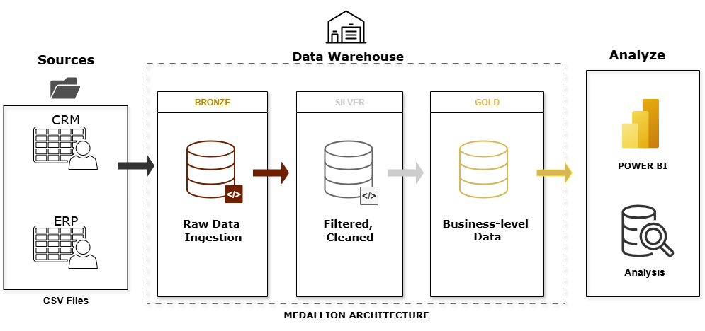
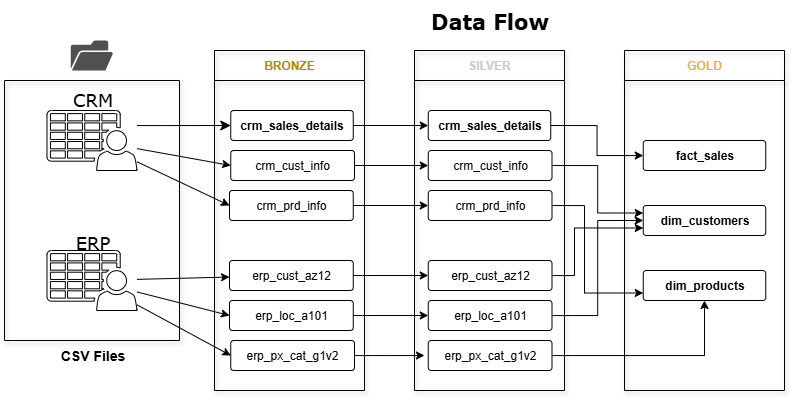
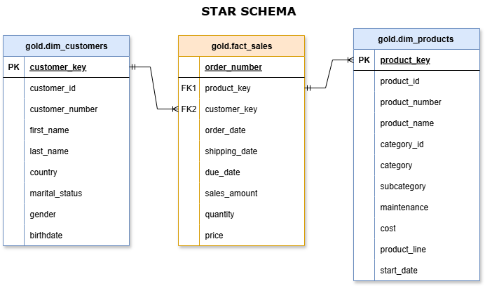
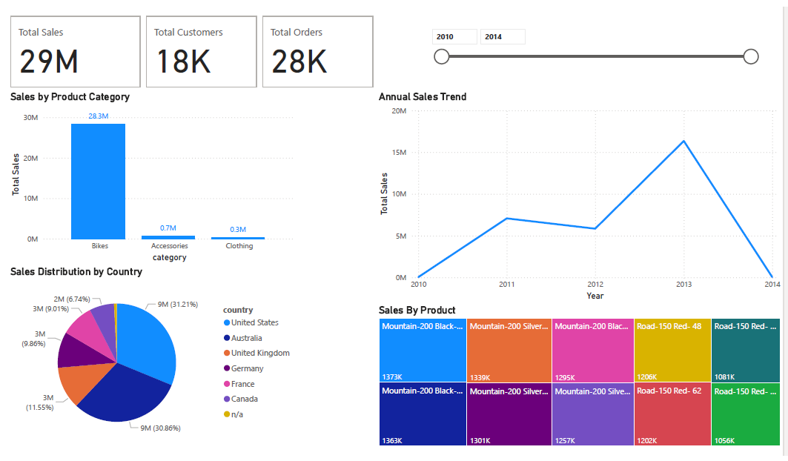
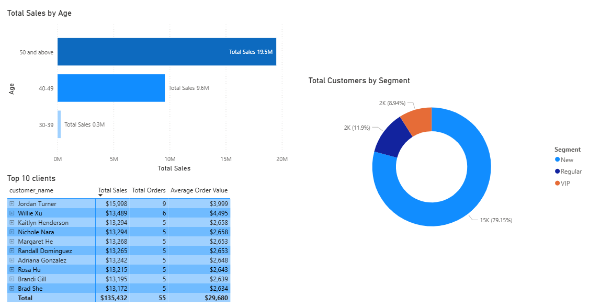
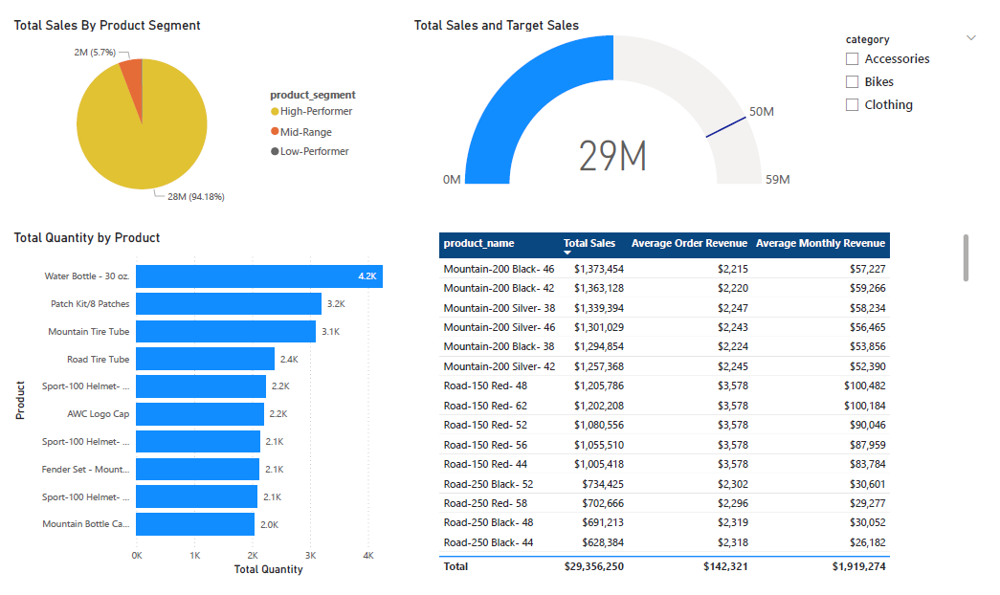

# End-to-End Data Warehouse & BI Project 

## Project Overview
This project showcases a modern data warehouse built on Medallion Architecture **(Bronze → Silver → Gold)** using **SQL Server**, with an Analytics Layer (SQL Views) and **Power BI** dashboards for business insights.

### Core Deliverables:

  - Data Architecture: Bronze (Raw) → Silver (Cleaned) → Gold (Business-Ready)
  - ETL Pipelines: Extract, transform, and load from CSV (CRM & ERP sources) into SQL Server.
  - Data Modeling: Star schema with fact and dimension views.
  - Analytics & Reporting: Pre-built SQL analyses + interactive Power BI dashboard.

## Tech Stack

- **Database**: *Microsoft SQL Server*
- **Modeling**: *Star Schema (Fact/Dimensions)*
- **Analytics**: *SQL views for product & customer reports*
- **BI**: *Power BI Desktop (Import)*


## Repository Structure
```
.
├── datasets/               # Source CRM & ERP CSVs
├── scripts/                # SQL scripts for Bronze, Silver, Gold
├── analyze_data/           # Analytics Layer SQL
├── *.drawio.png            # Architecture, ERD, Star Schema diagrams
├── PowerBiReport.pbix      # Power BI dashboard
└── README.md
```
---

## Architecture
| Layer      | Purpose                               | Objects             | Key Transformations                                                        |
| ---------- | ------------------------------------- | ------------------- | -------------------------------------------------------------------------- |
| **Bronze** | Raw data ingestion from source CSVs   | Tables              | None – data as-is                                                          |
| **Silver** | Cleaned, standardized, conformed data | Tables              | Data cleansing, normalization, enrichment, derived columns, business rules |
| **Gold**   | Business-ready analytics model        | Views (fact & dims) | Data integration, aggregations, business logic                             |



## Data Pipeline (ETL): Bronze → Silver → Gold

1. **Bronze Layer – Raw Data**  
   - **Objects**: Raw tables loaded directly from source systems.  
   - **Load**: Batch Processing, Full Load, TRUNCATE + INSERT.  
   - **Transformations**: None – data stored as-is.  
   - **Purpose**: Keep an exact copy of the source for reference and audit.  

2. **Silver Layer – Cleaned & Standardized Data**  
   - **Objects**: Cleaned and standardized tables.  
   - **Load**: Batch Processing, Full Load, TRUNCATE + INSERT via stored procedures.  
   - **Key Transformations**:  
     - Data Cleansing (remove duplicates, trim spaces, fix invalid values)  
     - Data Standardization (consistent formats for dates, codes, and text)  
     - Data Normalization (map codes to descriptive values)  
     - Derived Columns (calculated fields, e.g., `prd_end_dt`)  
     - Data Enrichment (fill missing values from multiple sources)  
     - Business Rules & Logic  
   - **Purpose**: Create a consistent dataset ready for integration into the final model.  

3. **Gold Layer – Business-Ready Data**  
   - **Objects**: Views for reporting and analytics.  
   - **Load**: N/A (data is queried from Silver in real time).  
   - **Key Transformations**:  
     - Data Integration (joins between cleaned sources)  
     - Aggregations (summary calculations for reporting)  
     - Business Logic (business-specific rules and metrics)  
   - **Purpose**: Provide a business-ready analytical model (Star Schema, Flat Tables, Aggregated Tables) for BI and reporting.  



## Data Sources
Two upstream systems provided as CSV files:  
- **CRM**: Customers, products, sales details  
- **ERP**: Customer demographics, locations, product categories  

---

## Data Model (Gold / Star Schema)
The Gold layer follows a **Star Schema** and is exposed as views  
(can be materialized as tables in future iterations):  

- **Fact Table**  
  - `gold.fact_sales`  

- **Dimension Tables**  
  - `gold.dim_customers`  
  - `gold.dim_products`  

**Keys**: Surrogate keys (e.g., `ROW_NUMBER()`) are generated in views and used for joins in the Gold layer.        


## Analytics Layer (SQL Views)
This layer contains pre-built SQL queries and views for various analytical use cases:

- **Change Over Time Analysis** – Analyze sales performance over time.  
- **Cumulative Analysis** – Calculate total sales per year, moving average price, and running sales total.  
- **Data Segmentation Analysis** – Segment products by cost ranges and customers by spending behavior (VIP, Regular, New).  
- **Database Exploration** – Provide general statistics and data discovery queries.  
- **Magnitude Analysis** – Compare absolute values across categories.  
- **Part-to-Whole Analysis** – Show category contribution to overall sales.  
- **Performance Analysis** – Analyze yearly product performance.  
- **Ranking Analysis** – Rank items based on key metrics (e.g., best/worst performing products).

**Business-Friendly Report Views**  
- `gold.report_products` – Consolidates key product metrics (sales, orders, customers, revenue KPIs) and segments products by performance category.  
- `gold.report_customers` – Consolidates customer metrics, segments by age group and spending category (VIP, Regular, New), and calculates KPIs such as total sales, orders, quantity, lifespan, recency, average order value, and average monthly spend.

## 📊 Power BI Reports

### 1) Overview
<a href="https://app.powerbi.com/groups/me/reports/8c048d3c-8e61-4b81-bc9b-34e0460128e7/1a9e6687dab32cbb0a76?experience=power-bi">
  
</a>

### 2) Customer Analysis
<a href="https://app.powerbi.com/groups/me/reports/8c048d3c-8e61-4b81-bc9b-34e0460128e7/2f6048b7e80ba7c57bce?experience=power-bi">
  
</a>

### 3) Product Analysis
<a href="https://app.powerbi.com/groups/me/reports/8c048d3c-8e61-4b81-bc9b-34e0460128e7/59b3ef7756173ea50083?experience=power-bi">
  
</a>


## How to Run
1) Import CSVs from /datasets into Bronze tables.
2) Execute ETL scripts in /scripts for Bronze → Silver → Gold.
3) Connect Power BI to Gold views for reporting.
